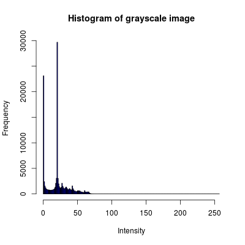
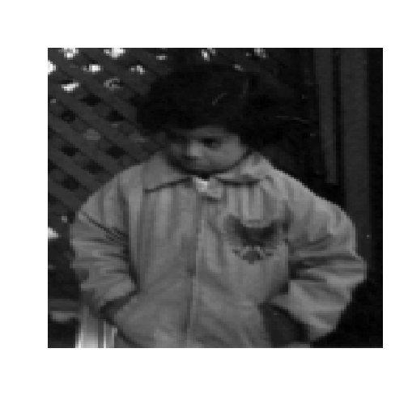
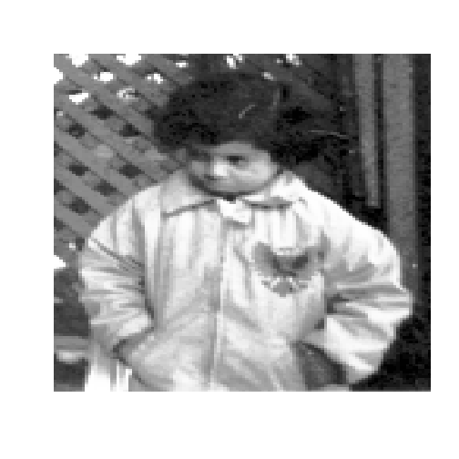

## Premise

* Images with poor contrast are those that look too dark, too bright, or too washed out
* If you plot the histogram using the intensity / colour channel for the bins, you will see that the values have little spread

<div style = 'text-align: center;'>


</div>

* By doing histogram equalization, the histogram will become **flat** and give a better contrast image
* The effect of histogram equalization is that it **stretches** the dynamic range of the histogram
* Histograms can easily be converted into discrete PDFs.  You assume that the probability of encountering a particular pixel is fair

--- .class #id 

## Some Math (for grayscale images)!

* Given the bin count $h_i$ of an intensity $i$ of an image, the probability of encountering this intensity $i$ is: $p_i = \frac{h_i}{MN}$ where $M$,$N$ are the number of rows and columns in the image
* To do histogram equalization, you choose the desired intensity levels you want to see, $L$
* Given $L$, the **output** intensity $g_i$, given an input intensity $i$ is thus:

$$g_i = (L-1)\sum_{i=0}^{L-1} p_i = \frac{L-1}{MN} \sum_{i=0}^{L-1} h_i$$

* The above produces a mapping where we take each pixel with an intensity $i$ and determine what its output intensity is $i$
* The above sum may be familiar to you.  We are essentially computing the **CDF** of the image
* The above equation stretches the histogram so that encountering each pixel is **equiprobable**
* By making each pixel equiprobable to be encountered, the best contrast is obtained
* The math in proving the above is beyond the scope of this talk.  [Check this link out for the proof](http://www.math.uci.edu/icamp/courses/math77c/demos/hist_eq.pdf)

---

## Histogram Equalization Demonstration

* Showing the original image


```r
library(png); img <- readPNG('pout.png');
image(t(img)[,nrow(img):1], axes = FALSE, col = grey(seq(0, 1, length = 256)))
```

 

---

## Histogram Equalization Demonstration

* Output  with 256 intensities.  Histogram Equalization source is quite long and can be found on my Github repo


```r
source("histEq.R"); library(png); img <- readPNG('pout.png'); outImg <- histEq(img, 256)
image(t(outImg)[,nrow(outImg):1], axes = FALSE, col = grey(seq(0, 1, length = 256)))
```

 
